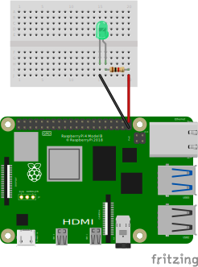

# rpi-gpio-blinker
Test container for Docker build and push Action and GPIO Access on RPi

## References
This image implements the LED Blink example from [gpiozero](https://gpiozero.readthedocs.io/en/latest/recipes.html#led)

## Wiring
